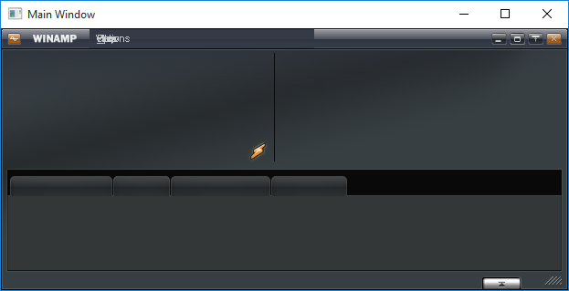

# Winamp Freeform skinning engine in WPF #
It really whips dead llama's ass.

Status: unusable, but some challenges overcome.

## Scripting engine ##

The scripting engine seems to be working. Scripts bind directly onto CLR events and methods.

Thanks: Ralf Engels ([mdc](http://www.rengels.de/maki_decompiler//index.html))

## XML loader ##

The weird breed of XML found in Winamp skins is re-processed to be fed into standard XML readers. Some attributes are mapped onto DPs.

At this point it's able to load and show some static stuff.

